# Chore Tracker

Chore Tracker is a small, self-hosted chore-and-rewards board for a shared household display. It runs as a local web app with no authentication, stores durable state in SQLite, and keeps point balances auditable through an append-only ledger.

The app is intentionally focused on one home and one trusted display. It is not a general project manager or multi-user SaaS app.

The screenshots below use mocked household data and the built-in Space theme.

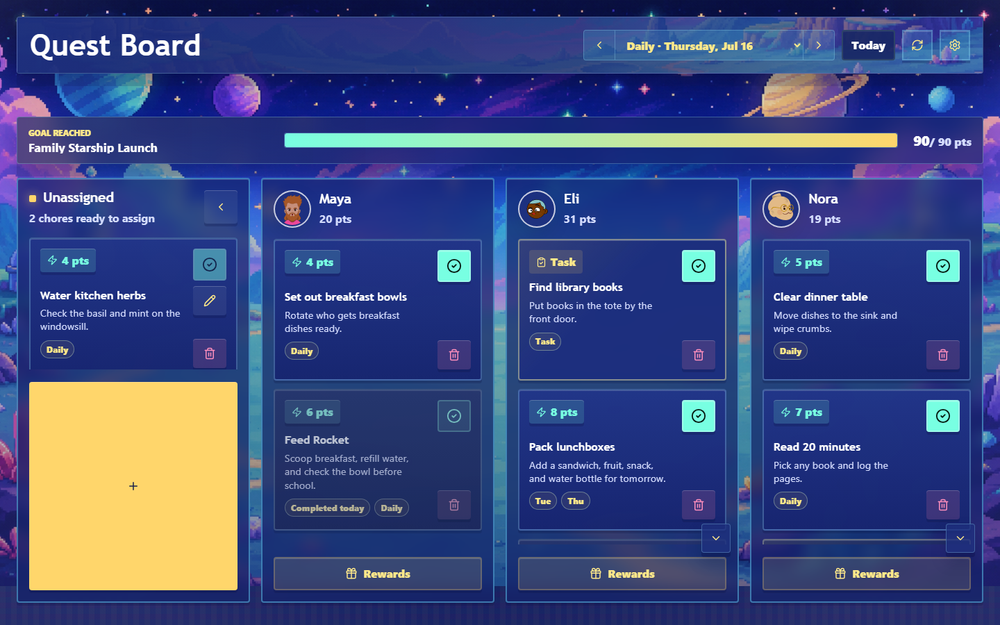

## Supported Features

### Daily Kiosk Board

- Shows one unassigned lane plus one lane per child/person.
- Displays each child with an avatar, visible chores, one-off tasks, and current point total.
- Uses large, touch-friendly controls intended for a tablet, kiosk, or shared browser.
- Keeps completed chores and tasks visible and visually muted for the day.
- Supports previous/next day navigation, a Today shortcut, and a switch to weekly view.

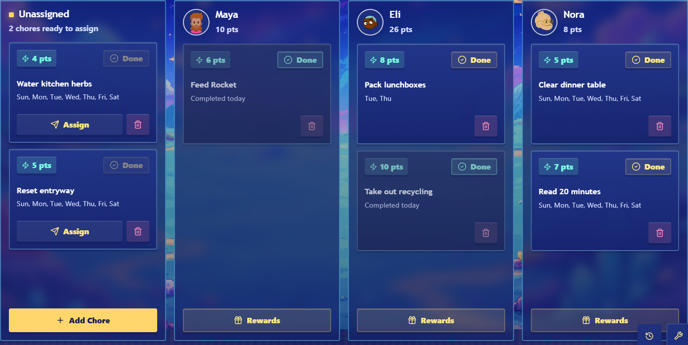

### Chores, Scheduling, And Rotations

- Add chores with title, description, point value, and schedule.
- Edit existing chores from the chore detail modal.
- Soft-delete chores so old ledger history remains intact.
- Leave chores unassigned, assign one chore to one or more children, or rotate a chore across children.
- Configure per-child weekday schedules for assigned chores and weekday availability for unassigned chores.
- Use `0 = Sunday` through `6 = Saturday` internally, matching JavaScript `Date.getDay()`.
- Complete and uncomplete chores for the selected local day.
- Block completion unless the chore is assigned to that child on that day.


### One-Off Tasks

- Add ad hoc tasks for a specific child without assigning points.
- Keep tasks visible on the board until completed or deleted.
- Record task completion and uncompletion in the ledger with zero-point entries for audit history.
- Show ongoing tasks in the weekly calendar when they do not belong to a scheduled day.

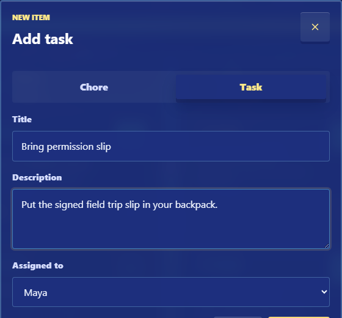

### Points Ledger And Adjustments

- Derives child point totals from `ledger_entries`; balances are not stored as mutable profile fields.
- Creates positive ledger entries for chore completion.
- Creates negative reversal entries when a chore is marked incomplete again.
- Creates negative ledger entries for reward redemption.
- Supports manual point overrides while preserving ledger history.
- Stores child and source name snapshots on ledger entries so history remains readable after names change.

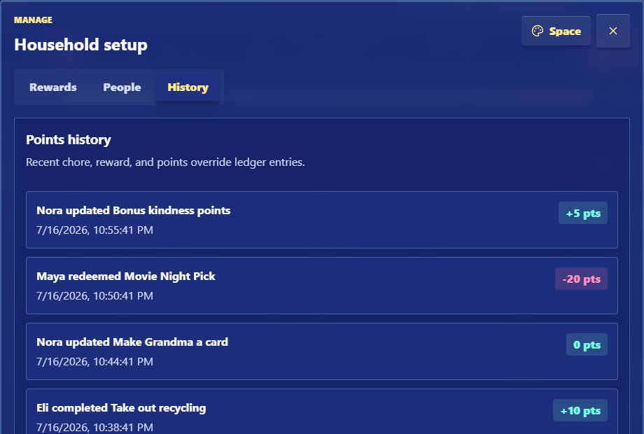

### Rewards

- Shows each child's available rewards from their lane.
- Disables unaffordable rewards in the UI and rejects overspending in the API.
- Shows a confirmation equation before redemption, for example `42 - 15 = 27`.
- Updates the total after redemption and briefly shows a success state.
- Lets household managers create, edit, and deactivate rewards.
- Keeps inactive rewards out of the redemption list while still visible in management.

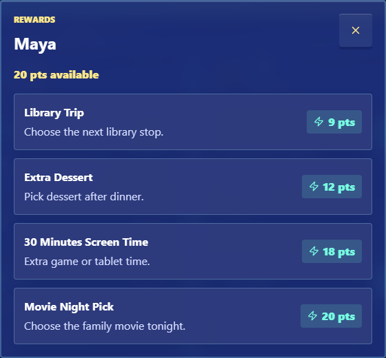

### Shared Progress Goal

- Shows the active household goal above the swim lanes on the daily board.
- Tracks points earned since the goal's start date and excludes reward redemptions from progress.
- Changes to a reached state when the earned total meets or exceeds the target.
- Lets the household mark a reached goal complete, which awards it and hides the goal bar until the next goal is set.


### Household Management And Goals

- Add and rename children/people from the Manage modal.
- Pick avatars for child/person lanes.
- Add, edit, and deactivate rewards.
- Track one active shared progress goal based on points earned since a start date.
- Switch between the built-in visual themes: Space, Quest, and Default.

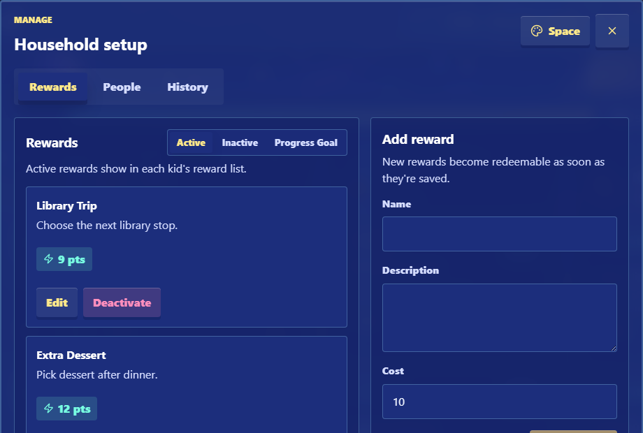

### Weekly Calendar

- Shows a week-at-a-glance calendar of scheduled chores by day.
- Supports previous/next week navigation and a switch back to the daily board.
- Opens chore details from a calendar card for quick schedule changes.
- Lists ongoing unscheduled tasks separately from dated chore cards.


## How To Use The App

### Add A Chore Or Task

1. Open the app and use the `Add Chore` button in the Unassigned lane.
2. Choose `Chore` for a point-bearing recurring item or `Task` for a one-off assignment.
3. Enter a title, optional description, and the required fields for that mode.
4. Save. Chores appear on matching days; tasks appear in the assigned child's lane.

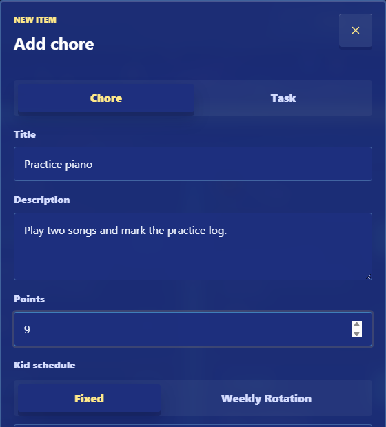

### Assign Or Reschedule A Chore

1. Open a chore card or use `Assign` on an unassigned card.
2. In the chore detail modal, select the weekdays for each child who should see that chore.
3. Use rotation when one chore should move between children over time.
4. Clear a child's weekdays to remove that child from the chore.
5. Save changes.

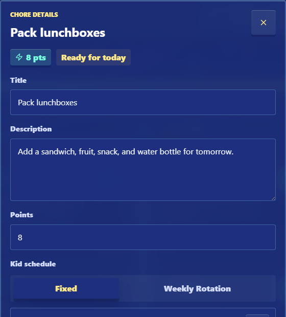

### Complete Or Undo Work

1. Tap `Done` on an assigned chore or task card.
2. For chores, the app creates a completion record and a positive ledger entry for that child.
3. For tasks, the app records a zero-point ledger event so the history still shows what happened.
4. Tap `Done` again on a completed card to reverse it for the day.
5. The app preserves the original ledger entry and adds a reversal entry where points changed.

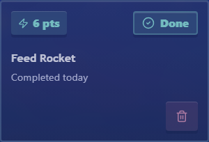

### Redeem A Reward

1. Tap `Rewards` in a child's lane.
2. Select an affordable reward.
3. Confirm the point equation.
4. The app creates a redemption ledger entry and refreshes the child's total.

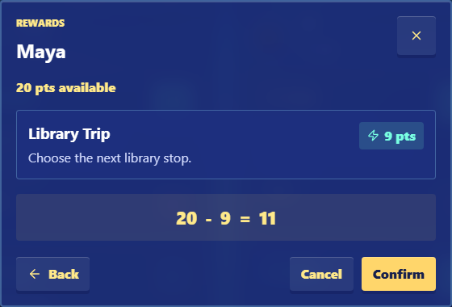

### Complete A Shared Goal

1. Set a progress goal from `Manage`.
2. When household earned points reach the target, use `Complete goal` on the board goal bar.
3. The app awards the goal and removes the goal bar until another goal is configured.

### Manage People, Rewards, Goals, And Theme

1. Open `Manage` from the top bar.
2. Use `Rewards` to create, edit, or deactivate reward catalog entries.
3. Use `People` to add or rename children/people.
4. Use `Progress Goal` to configure the current shared goal.
5. Tap a child's avatar on the board, or from management, to change it.
6. Use the theme button in management to cycle visual themes.


### Review History And Adjust Points

Open `Manage`, then use the `History` tab to review recent chore, task, reward, and point override activity. The Rewards management view also includes an `Add points override` form for manual corrections.


### View The Weekly Calendar

Use the calendar selector in the top bar to switch from the daily board to the weekly view. Use the arrow controls to move between weeks, and select `Daily` to return to the board.

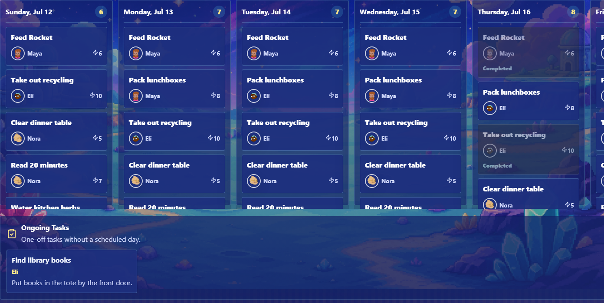

## Local Development

Requirements:

- Node.js 22+
- npm

Install dependencies:

```bash
npm install
```

Create a working database from the starter DB:

```bash
cp data/sample.db data/chore-tracker.db
```

Run the local dev server:

```bash
npm run dev
```

Open:

- App: [http://localhost:5173](http://localhost:5173)
- API healthcheck: [http://localhost:3001/api/health](http://localhost:3001/api/health)

Build:

```bash
npm run build
```

Run tests:

```bash
npm test
npm run test:e2e
```

## Runtime Configuration

Supported environment variables:

- `PORT`: production API/static server port. Default: `3001`.
- `DATA_DIR`: directory for the SQLite file. Default: `<repo>/data`.
- `DATABASE_PATH`: explicit SQLite file path. Overrides `DATA_DIR`.
- `TZ`: process/container timezone. Recommended for Docker deployments because weekday scheduling follows server-local time.
- `API_PORT`: dev-only Vite proxy target.
- `VITE_PORT`: dev-only Vite port.

The runtime expects an initialized SQLite database at the configured path. For a new installation, copy `data/sample.db` to the target database path before starting the server. Startup applies idempotent schema setup for compatibility, but it does not seed household data into an empty database.

## Docker

Build the image:

```bash
docker build -t chore-tracker .
```

Prepare a persistent data location with the starter database before first run. For example, with a bind-mounted folder:

```bash
mkdir -p ./runtime-data
cp data/sample.db ./runtime-data/chore-tracker.db
```

Run it with persistent data:

```bash
docker run -d \
  --name chore-tracker \
  -p 8080:3001 \
  -e TZ=America/Los_Angeles \
  -e DATA_DIR=/data \
  -v "$(pwd)/runtime-data:/data" \
  chore-tracker
```

Open:

- App: [http://localhost:8080](http://localhost:8080)
- Healthcheck: [http://localhost:8080/api/health](http://localhost:8080/api/health)

Stop:

```bash
docker stop chore-tracker
docker rm chore-tracker
```

## Docker Compose

Run:

```bash
docker compose up --build -d
```

Stop:

```bash
docker compose down
```

The included compose file maps host port `3001` to container port `3001` and stores SQLite in a named Docker volume mounted at `/data`. For a fresh named volume, initialize `/data/chore-tracker.db` from `data/sample.db` before starting the app.

## Deployment Guidance

The app is designed to run as a single Node.js web process. In production it serves both the API and the compiled frontend from the same port.

Common deployment options:

- Run the Docker image on any host that supports persistent volumes.
- Use `docker compose` or another container orchestrator to manage restart policy, port mapping, and the SQLite data volume.
- Run from source with `npm run build` followed by `npm start` if you prefer a non-container deployment.
- Put the app behind an existing reverse proxy if you need HTTPS, a custom hostname, or path-based routing.

Production checklist:

1. Initialize the configured SQLite file from `data/sample.db`.
2. Map container port `3001` to whatever host port you want users to visit.
3. Mount persistent storage to `/data`, or set `DATABASE_PATH` to a persistent file path.
4. Set `TZ` to the household's timezone so weekday chore boundaries are predictable.
5. Set a restart policy appropriate for your host.
6. Verify `GET /api/health` returns `status: "ok"`.
7. Create a chore, restart the process/container, and confirm the chore is still present.

Network and security notes:

- Chore Tracker does not include authentication or authorization.
- Treat it as a trusted-network app unless you add access control at a reverse proxy or network layer.
- If embedding the app in another dashboard or portal, make sure browser mixed-content rules do not block it. Serving both pages over HTTPS is the usual fix.
- Use a stable hostname or IP address for any shared display that opens the app directly.

## Data And Backups

- Primary data store: SQLite.
- Starter database: `data/sample.db`.
- Default local DB path: `data/chore-tracker.db`.
- Recommended container DB path: `/data/chore-tracker.db`.
- SQLite runs with WAL mode enabled.

Back up the app by backing up the configured SQLite database and WAL files from the mounted data directory. For the simplest file copy, stop the container/server first or use your normal volume backup tooling.

## Technical Details

For a deeper contributor-oriented view of runtime shape, service boundaries, data model, and domain invariants, see [ARCHITECTURE.md](./ARCHITECTURE.md).

### Stack

- Frontend: React 19, TypeScript, Vite, CSS.
- UI icons: `lucide-react`.
- Backend: Node.js 22, Express 5, TypeScript.
- Database: SQLite through `better-sqlite3`.
- Validation: `zod`.
- Tests: Vitest for service/API-adjacent behavior and Playwright for end-to-end browser coverage.
- Deployment: multi-stage Docker build serving the compiled frontend and API from one Express process.

### Runtime Shape

In development, Vite serves the client on port `5173` and proxies API calls to the Express server on port `3001`.

In production, the compiled Express server serves:

- `/api/*` JSON endpoints.
- Static frontend assets from `client-dist`.
- SPA fallback to `index.html` for non-API routes.

### Core Data Model

The main tables are:

- `children`: board lanes, display names, avatar keys, and sort order.
- `chores`: chore definitions, point value, active flag, and timestamps.
- `chore_schedule_days`: weekdays when an unassigned chore is visible.
- `chore_assignments`: per-child weekday assignments for visible assigned chores.
- `chore_rotations`, `chore_rotation_children`, `chore_rotation_days`: rotating chore assignment rules.
- `tasks`: one-off assignments that can be completed without point value.
- `progress_goals`: one active shared point target and awarded goal history.
- `chore_completions`: per-day completion state with reversal links.
- `rewards`: reward catalog entries and active/inactive state.
- `ledger_entries`: immutable point events used to derive balances and history.

### API Surface

Current endpoints include:

- `GET /api/health`
- `GET /api/dashboard?date=YYYY-MM-DD`
- `GET /api/calendar/week?start=YYYY-MM-DD`
- `GET /api/children`
- `POST /api/children`
- `PATCH /api/children/:id`
- `POST /api/chores`
- `PATCH /api/chores/:id`
- `DELETE /api/chores/:id`
- `PATCH /api/chores/:id/assign`
- `POST /api/chores/:id/complete`
- `POST /api/chores/:id/uncomplete`
- `POST /api/tasks`
- `DELETE /api/tasks/:id`
- `POST /api/tasks/:id/complete`
- `POST /api/tasks/:id/uncomplete`
- `GET /api/rewards`
- `POST /api/rewards`
- `PATCH /api/rewards/:id`
- `DELETE /api/rewards/:id`
- `POST /api/rewards/:id/redeem`
- `GET /api/progress-goals/active`
- `POST /api/progress-goals`
- `PATCH /api/progress-goals/:id`
- `POST /api/progress-goals/:id/award`
- `GET /api/history/recent`
- `POST /api/ledger/adjustments`

### Design Constraints

- No authentication or authorization in the app.
- Single-household, trusted-network deployment.
- Ledger entries are append-only for point changes.
- Chore deletion is soft deletion through `is_active = 0`.
- Reward deletion deactivates rewards instead of removing historical context.
- Local date behavior follows the server/container timezone.

## Screenshot Regeneration

The README screenshots are generated from mocked household data:

```bash
npm run screenshots:readme
```

The script starts the dev server by default and captures `SCREENSHOT_BASE_URL`, defaulting to `http://127.0.0.1:5173`. Set `SCREENSHOT_USE_EXISTING_SERVER=1` if you want to point it at an already-running app.

## Verification

See [MANUAL_QA_CHECKLIST.md](./MANUAL_QA_CHECKLIST.md) for a concise manual verification pass.

Release history belongs in GitHub Releases and git tags rather than a checked-in roadmap.
